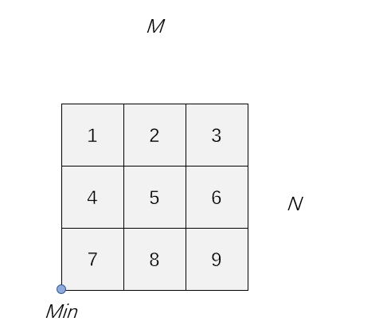
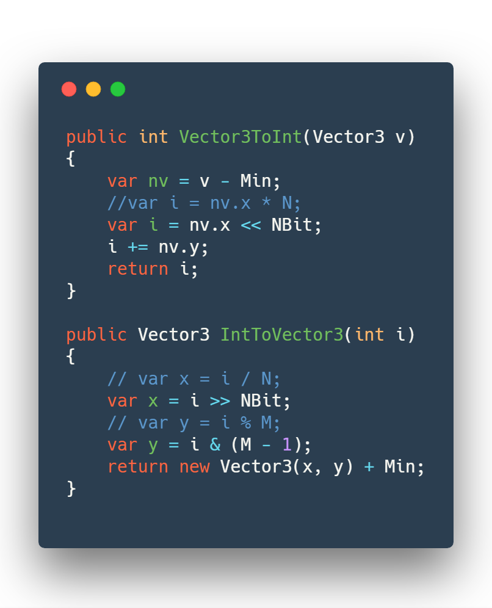
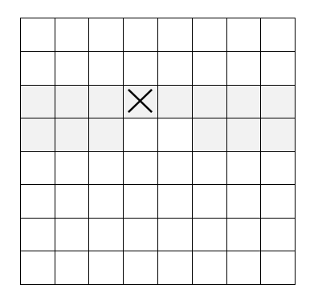

# 优化方案

## 享元模式

使用享元模式来共享游戏模型中相同的数据。例如，在游戏的森林场景里，有很多树的模型共享了相同的数据，这些模型如果都存储这些数据的话，那么需要占用大量的存储空间。使用享元模式之后，这些模型共享相同的内部状态，每个模型只要存储不同的外部状态即可。

    

## 位运算

将一些关键参数转换为 2 的指数幂，那么原来的乘法运算转换为左移操作，除法运算转换为右移操作，求余运算转换为与运算，大大提高了计算速度。

这是受到 JDK 中 HashMap 的启发，HashMap 将数组长度转换为最小的 2 的指数幂，那么在求一个节点所在的数组下标的时候，就可以将原来的求余运算转换为位与运算。

     
    

## 乐观策略

在破坏模型之后需要进行一个分隔分析来判断模型是否被破坏成多个部分，如果是的话，就要为每个部分新建模型。

一种悲观的策略是进行一次全局的深度优先搜索，而我采用的是乐观策略，先对破坏位置进行分析，如果没有被分割成多个部分，那么整体一定没有被分割成多个部分，否则就改为进行一次全局的分析。

这是受到乐观锁的启发，在这里全局的分析相当于加锁，而我们应该尽量避免加锁操作，因为代价很高，所以就先尝试不加锁，只有在发生冲突时才进行加锁。

下图中，左边是全局分隔分析示意图，右边是局部分隔分析示意图。

     
    

## 递归优化

将原来的递归操作转换为迭代操作，避免 Stack Overflow。

模型分隔分析需要进行一次全局的深度优先搜索。在未优化之前，采用的是递归的方式实现，但是因为需要搜索上百万个节点，因此出现了 StackOverflow。使用迭代改进之后，就不需要将一些数据压入递归栈中，基本不消耗内存。

